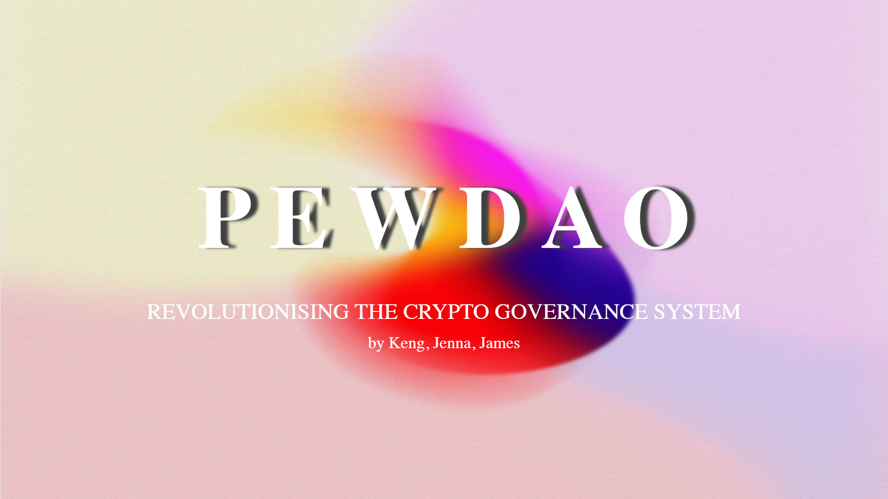
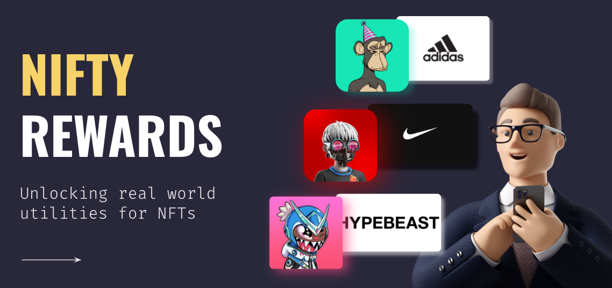
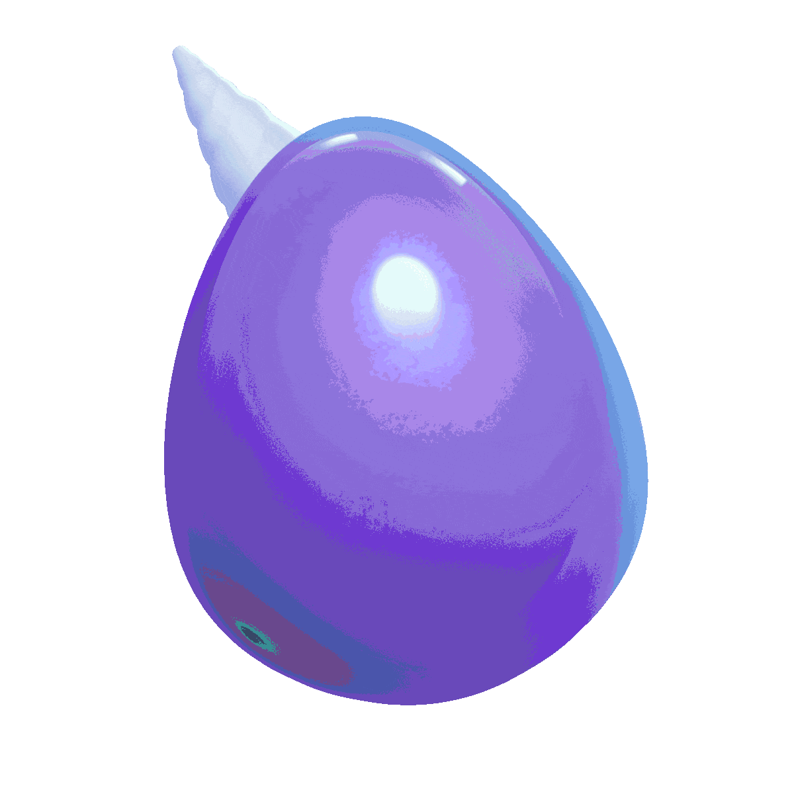
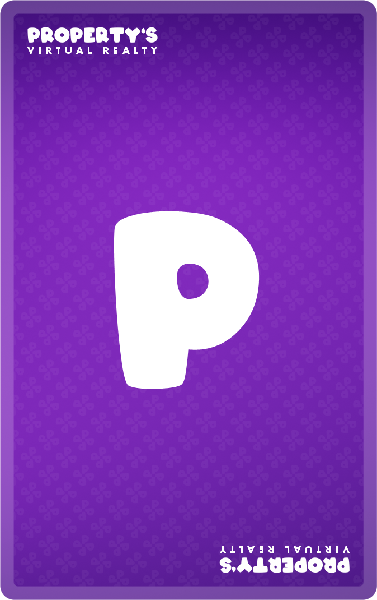
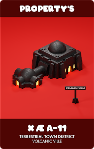
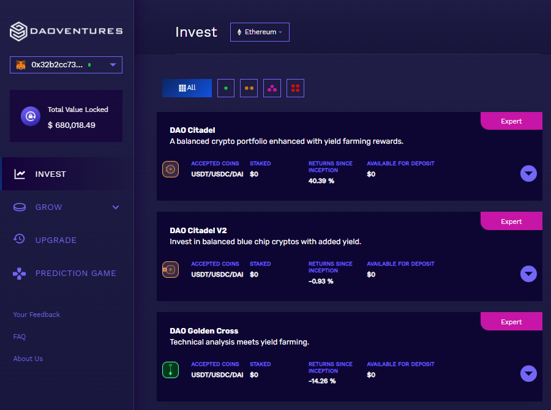
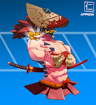

<!-- markdownlint-disable MD033 -->

<h1 align="center">Kenk's GitHub Profile</h1>

Welcome to my Github profile. I am a web3 **BUIDLR** that develops community-first products. My development style is ~~lean and agile~~ fast game baddabingbaddaboom.

## &nbsp; **2023 Major Projects**

### EtherCard - Contactless Crypto Payments (Scaling Ethereum 2023)
<i>🥇 Scaling Ethereum Finalist </i>
<i>🏆 Taiko Sponsor Prize (1st) </i>
<i>🏆 Scroll Pool Prize </i>
<i>🏆 Optimism Pool Prize </i>

</a>

Ethercard is a revolutionary payment solution that allows individuals and business owners to easily and securely receive cryptocurrency payments using NFC technology. With Ethercard, the receiver can request payments on their mobile device, and the sender can tap their Ethercard, which is a physical card embedded with an NFC chip linked to their crypto wallet. This acts as the "signature" to approve the transaction, making payments seamless and secure.

Our product solves the problem of complicated and error-prone crypto payments by simplifying the process without compromising security. We wanted to answer the question: “How might we simplify crypto payments for more users without compromising security?”. Ethercard is designed to be user-friendly, with a mobile app that enables users to request and receive crypto with just a few taps. Using ZK and account abstraction ensures that payments are safe and secure.

Ethercard is perfect for small business owners like Jorge (our user persona in the demo video), who can now easily accept crypto payments without the hassle of traditional payment systems. With our cutting-edge technology, you can rest assured that your payments are transparent and secure.

For future improvements, we would like to enable phone-to-phone payments so users can tap their phones with others to send/receive payments. In addition, we want to support 100+ cryptocurrencies in addition to ETH.

Join us in the future of payments with Ethercard!

<https://github.com/EtherCardX/EtherCard>
<https://ethglobal.com/showcase/ethercard-zv78k>

### 0xStems - Airdrop

Airdrop script to release NFTs to users who voted on 0xStems and frontend modifications

### BluebirdSwap - On-chain Fractionalised NFT Options Trading  (ETHDenver #BUIDLathon 2023)

<i>🏆 The Graph — Best New Subgraph(s)</i>

NFTs (Non-Fungible Tokens) have become increasingly popular in recent years as a way to represent unique digital assets such as artwork, music, and video game items. However, high-value NFTs can be expensive and illiquid, making it difficult for smaller investors to gain exposure to the market.

With BluebirdSwap, users can buy and sell fractional ownership of NFTs, which makes it possible for smaller investors to participate in the market. This allows users to buy a share of a valuable NFT without having to pay the entire price upfront. Fractional ownership also allows investors to diversify their portfolios by owning a stake in multiple NFTs. BluebirdSwap provides a new way to speculate on the value of these assets. This is not possible on OpenSea or other NFT marketplaces, which only support direct trading of NFTs.

In addition to fractionalized NFTs, BluebirdSwap also offers an options trading platform for NFTs. Users can buy calls or puts on fractionalized NFTs, which allows them to potentially profit from price movements without having to buy the entire asset. This provides flexibility and risk management for investors who may not want to take on the full risk of owning an entire NFT. The premium for the options contracts is paid in the specific fractionalized NFT tokens.

<https://github.com/Web3Rizzards>

<https://app.buidlbox.io/projects/bluebirdswap>

## &nbsp; **2022 Major Projects**

### :dash: PreshMail - Decentralized Chat App with Attention Monetization (ETH SanFrancisco 2022)

<i>🏆 Lens Protocol — Integration</i>
<i>🏆 XMTP — Runner Up</i>
<i>🏆 Push Protocol — Runner Up</i>

</a>

Modern day social media is plagued with ads and people sending unsolicited messages to strangers due to the ease of doing so via bots and automation. We feel that it is unfair that you have to waste your precious attention on spam and unwanted messages.

Ad services such as Google Ad sense helps you to monetize your attention to a certain degree, but what if we could democratize this whole process?

There are existing solutions out there to do exactly this, such as the Brave browser, but there has not been one in the area of text messaging.

<https://github.com/Omegachads>

<https://ethglobal.com/showcase/preshmail-rnuzb>

### 🎮 DappStop - Decentralized App Store (ETH Bogota 2022)

<i>🏆 Optimism — Optimism Games & NFT Infrastructure</i>
<i>🏆 IPFS/Filecoin Sponsor Prize</i>
<i>🏆 Klaytn — Best Use</i>
<i>🏆 Push Protocol — Best Use</i>
<i>🏆 Polygon Pool Prize </i>
<i>🏆 IPFS/Filecoin — Top 19</i>

</a>

DappStop is a censorship-resistant mobile app distribution platform. Unlike the existing app stores, DappStop empowers creators by removing any form of restrictions on in-app monetization.

<https://github.com/dAppStoppers>

<https://ethglobal.com/showcase/dappstop-fp7y3>

### :dash: Woosh - Web2 Friendly Crypto P2P Payment App (ETH Mexico 2022)

<i>🥇 ETH Mexico Finalist </i>
<i>🏆 IPFS/Filecoin Sponsor Prize </i>
<i>🏆 The Graph Sponsor Prize </i>
<i>🏆 LENS Honorary Prize </i>
<i>🏆 WorldCoin Pool Prize </i>

</a>

Woosh aims to onboard web2 users into the world of crypto by providing a user-friendly and intuitive cash app. It's simple enough for web2 users and functional enough for web3 users. Little to zero knowledge of crypto, Ethereum, or gas fees is necessary for the user to get started. We aimed to make this cash app as simple as humanly possible. Imagine Web3 + Venmo, with Woosh, you can follow your friends, request/send crypto, customize your profile and have peace of mind that every transaction you complete is with a verified human. No bots allowed!

<https://github.com/wooshorg>

<https://ethglobal.com/showcase/woosh-pu1fn>

### 👻👐 GAAVE - Charity Yield Farming (ETH Seoul 2022)

<i>🥇 Public Goods Track Winner </i>
<i>🏆 IPFS/Filecoin Sponsor Prize </i>
<i>🏆 The Graph Sponsor Prize </i>

</a>

<i>Giving + AAVE = GAAVE</i>

GAAVE is a yield farming for charity platform built by team GigaChads at ETH Seoul 2022.

A platform where crypto users could deposit their cryptocurrencies to generate yield for a cause. To further drive engagement, soulbound NFTs would be available for claim whenever a user reaches certain milestone when generating yield for a cause.

<https://github.com/GigaChadds>

### 👐 GIV3 - Charity Yield Farming (Morpheus Labs Hackathon 2022)

<i>🥈 Morpheus Labs Hackathon Runner-up</i>

</a>

<i>Safeguarding the future of philanthrophy</i>

Giv3 (read: Give) is a platform where philanthropic organizations may utilize to quickly adopt NFTs to fundraise for their cause. The team identified that more could be done to aid philanthropic efforts around the world, and the solution to that was to allow philanthropic organizations create NFTs that are enga

<https://github.com/Giv3rs>

### 🚫◼️✏️ Unblogged - Censorship Resistant Blogging (HackFS 2022)

<i>🏆 IPFS/Filecoin Sponsor Prize</i>

Blogging + Unblocking Censorship = Unblogged. Unblogged was submitted as a hackathon project for HackFS 2022.

Unblogged is a blogging application that unblocks any form of censorship (Blog + Unblock = Unblogged). It utilizes IPFS to keep user's articles persistent and censorship resistant and Markdown language for a pleasant and familiar writing interface.

Our team's goal for this hackathon is to develop a 100% decentralized platform using the power of IPFS, hence, all the tools used to support this platform is completely decentralized. Unblogged is hosted using [Fleek](https://github.com/FleekHQ), which allows **Unblogged** to be permissionless, trustless, censorship resistant, and free of centralized gatekeepers. Every article that a user writes will be published and pinned on [IPFS](https://github.com/ipfs) using [web3.storage's](https://github.com/web3-storage) SDK. This means that the user's article would be almost impossible to be censored. Each article is also minted as an NFT on Polygon which is integrated with [Tableland](https://github.com/tablelandnetwork) such that every article can be searched (using a simple SQL query) on the Homepage of Unblogged by the article's title or tags.

<https://github.com/Unblogg>

### :gift: PEW - On-Chain Reputation Governance (ETH NYC 2022)

<i>🏆 Worldcoin Pool Prize</i> <i>🏆 Optimism Pool Prize</i>

The project was submitted as part of ETHNYC 2022 organized by ETHGlobal. Current governance modals that uses tokens as voting power suffer from voting inequality. Rich users that may not have the best interest of the DAO in mind can easily pass proposals that are in their favour instead of the DAO.

PEW aims to solve this voting issue by introducing an on-chain reputation system that is fully democratized. Individuals have to self-declare their contributions to the DAO which are either vouched or refuted via Upvoting or downvoting respectively. The overall voting power an individual have will be:

$A * Time\ Spent\ In\ DAO * B * Total\ Number\ Of\ Upvotes * C * Total\ Number\ Of\ Downvotes * D * Total\ Number\ Of\ Reviews\ Given$

where A, B, C, and D are customizable weights.

<https://github.com/FloorGangETHNYC>

<https://ethglobal.com/showcase/pew-pza8i>

### :gift: Nifty Rewards - NFT Reward Discovery Platform (ETH Amsterdam 2022)

<i>🏆 Web3 Auth Sponsor Prize</i>

The project was submitted as part of ETHAmsterdam 2022 organized by ETHGlobal. Our group identified a key problem with NFTs and it is the struggle for teams to provide utilities. A fully digital metaverse is not here yet and people will always still seek comfort in tangible real world utilities. Today, we have millions of brands and services out there looking for consumers but there is no easy way for them to tap on the users and liquidity accumulated in the NFT ecosystem.

Bigger brands like Nike and Adidas have the purchasing power to acquire successful NFT collections but what about the 99% of merchants out there?

Over the 36-hours hackathon, my team prototyped a which platform serves as a Discovery Reward platform for users and a one-stop platform for merchants to kickstart nft reward campaigns. Onboarding web2 users and merchants is seamless with the use of technologies like web3Auth and walletConnect.

Find out more about the project at our repository:

<https://github.com/NiftyRewards>

## &nbsp; **2021 Major Projects**

### :unicorn: UninterestedUnicorns - Gen 1 Minting

ERC721 Smart Contract for the sales of the initial 6900 UninterestedUnicorns. Project was sold out under 15 minutes with 307.308 ETH in revenue.

Images were randomly generated using Node.js image generation scripts and hosted on IPFS.

### :unicorn: UninterestedUnicorns - Questing

Staking smart contract where UU holders can interact with to lock up UU tokens to gain UniCandy UCD rewards. Inspired by Decentralized Finance. Special combos of UUs staked & duration of quests will result in a bonus UCD multiplier.

### :unicorn: UninterestedUnicorns - UCD Token

ERC20 Token for the UninterestedUnicorns ecosystem.

### :unicorn: UninterestedUnicorns - Breeding

Breeding smart contract where users can use their Gen 1 UUs to breed Gen 2 UUs. Breeding logic is done off-chain to save gas costs. All the traits of the Gen 1 UUs were mapped and stored in a MongoDB server into a chromosome type model. On token mint, backend logic takes in 2 of such chromosomes to output a baby Gen 2 UU that inherits the parent's traits with a random mutation chance. Heroku was used to host the backend API.

### :house: PropertysNFT - Minting

ERC721 Smart Contract for the sales of the initial 6000 Propertys. Project was sold out under 15 minutes with 482.21 ETH in revenue. Off-chain whitelisting was implemented to save about 5 ETH (~20k USD) in gas cost for 2000 whitelist spots (0.25 ETH per 100 whitelist spots)

### :moneybag: DAOVentures - BNB Prediction Game

Prediction Game where users can bet on whether the price of BNB will go up or down in a specified timeframe. Price of BNB is retrieved from the BNB/USD Chainlink Oracle.

### DAOVentures - Frontend Development

React website with web3.js integration for DAOVentures DeFi.

## &nbsp; **2021 Minor Projects**

### :crossed_swords: ShogunSamurais - Staking (Audit)

### PlaybookXO - Minting (Audit)

### Royalties Splitter

A simple and lightweight smart contract to distribute ETH automatically as it is deposited to the address.

## 🔧 &nbsp;**Current Tech Stack**

## 🧰 &nbsp;**Unused Tech**

## 🕒 &nbsp;**Time Spent in the Matrix**

